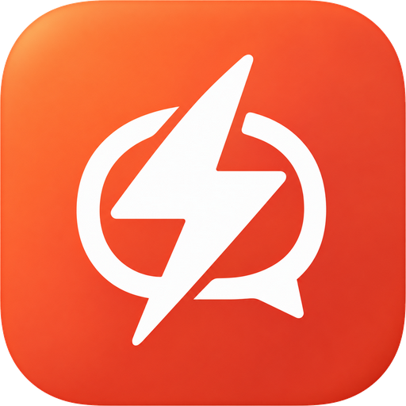
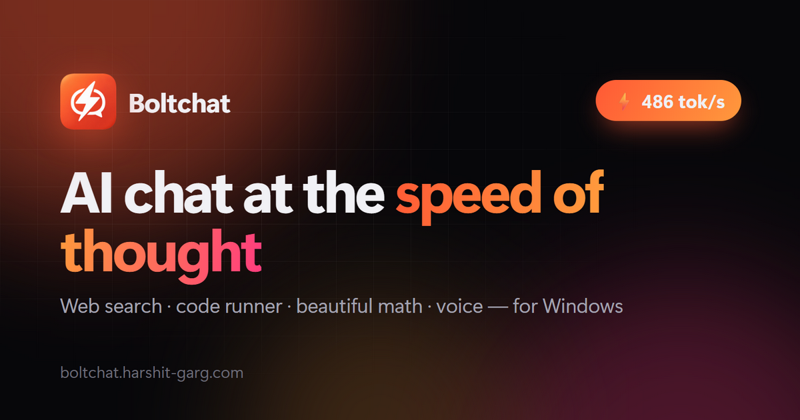

<div align="center">



# Boltchat — website

**AI chat at the speed of thought.**
The marketing, leadership and legal site for Boltchat, a fast chat app for Windows (and Android, in beta) for the open models on Groq.

[**boltchat.harshit-garg.com**](https://boltchat.harshit-garg.com) · [Privacy](https://boltchat.harshit-garg.com/privacy.html) · [Terms](https://boltchat.harshit-garg.com/terms.html) · [Legal](https://boltchat.harshit-garg.com/legal.html) · [Leadership](https://boltchat.harshit-garg.com/leadership.html)



</div>

---

## About Boltchat

Boltchat is a Windows desktop app that streams answers from the open models on [Groq](https://groq.com) at hundreds of tokens per second. It is built by **Harshit Garg, Founder & CEO**.

| | |
|---|---|
| ⚡ **Fast** | 400+ tokens/sec on GPT-OSS 120B, with live speed on every reply |
| 🌐 **Web search** | `/web` — the model searches, reads pages and cites its sources |
| 🐍 **Code runner** | `/code` — real Python for exact answers, with code and output shown |
| ∑ **Beautiful math** | LaTeX, matrices and chemistry typeset with KaTeX |
| 🎙 **Voice input** | Whisper transcription in well under a second |
| 🗂 **Projects** | Grouped chats with shared instructions, searchable files (PDF, Office, EPUB, code) and earlier-chat recall |
| ✦ **Memory** | Optional: remembers facts about you across chats — add, review and delete them in Settings |
| ⌨ **Code workspace** | Monaco (VS Code) editor for trusted folders, with a LangGraph coding agent that plans, reads and edits files as diffs you review, runs your tests behind a GPT-OSS 20B safety gate, and supports undo, resumable runs and inline Ctrl+K edits |
| ▶ **Terminal & browser** | A real shell under the editor, and a built-in browser the agent drives to QA web pages (clicks, typing, console, vision checks) |
| 📰 **Fresh ideas** | New-chat suggestions from your memories, today's top stories (merged from seven public-service newsrooms and ranked by coverage) and fun ideas |
| 🔒 **Private** | No account, no tracking; chats and memories stay on your PC |

Boltchat is available on the [Microsoft Store](https://apps.microsoft.com/detail/9NXXLRNBMWG0). It needs your own Groq API key ([free tier available](https://console.groq.com/keys)).

## This repository

A dependency-free static site — no build step, no framework, no tracking.

```
.
├── index.html          Landing page (hero, features, live streaming demo)
├── getting-started.html Installation, first-run and troubleshooting guide
├── code-workspace.html  Detailed Code workspace product guide
├── private-ai-chat.html Plain-language privacy and data-flow overview
├── android.html         Android beta page: features and a signup form (same Formspree form xrpbrkkp) that reveals the tester Google Group and the Play opt-in link
├── changelog.html       Current release notes
├── leadership.html     Leadership team
├── privacy.html        Privacy policy  ─┐
├── terms.html          Terms of use     ├─ linked from the Microsoft Store listing and the app
├── legal.html          Legal & licenses ─┘
├── contact.html        Contact form (Formspree form xrpbrkkp; see the contact block in site.js)
├── 404.html            Not-found page
├── style.css           All styles (dark + light themes, reduced-motion aware)
├── app-demo.css        The live app demos: Boltchat recreated in HTML/CSS, sharp at any size
├── site.js             Progressive enhancements: navbar, scroll reveal, demos, TOC
├── assets/             Icon, social image, leadership photo
├── scripts/             SEO validation and IndexNow notification
├── .github/workflows/   Automated SEO checks and discovery notification
├── robots.txt, sitemap.xml, llms.txt
└── CNAME               Custom domain for GitHub Pages
```

### Preview locally

```bash
npx serve .
```
Then open http://localhost:3000. (Any static file server works; opening the HTML files directly also works, except the root-relative links on `404.html`.)

### Deploy

Every push to `main` is published by **GitHub Pages** to https://boltchat.harshit-garg.com, with HTTPS enforced.
DNS: a `CNAME` record for `boltchat` pointing to `hgarg1.github.io`.

The `SEO and discovery` workflow validates every pull request and push. After a
push to `main`, it also tells IndexNow which public URLs changed. The verification
key is intentionally public at the site root, as required by the IndexNow protocol.

Run the same checks locally before committing:

```bash
node scripts/check-seo.mjs
node scripts/indexnow.mjs --dry-run
```

### Common edits

| To change… | Edit |
|---|---|
| Leadership bio or links | `leadership.html` (`.leader-info`) |
| App demos (hero, code runner) | Markup in `index.html` (`.app[data-demo]`), styles in `app-demo.css`. `data-at="n"` shows an element at step n, `data-done="n"` ticks a plan item; `data-ms`/`data-hold` on a `.scene` set its pace. Math uses `data-tex` (KaTeX) with a plain-text fallback |
| Policy wording | The page, **and** its "Effective"/"Updated" date near the top |
| Social preview image | `assets/og-image.png` (1200×630) |
| New page | Copy an existing page's `<head>`, header and footer; add it to `sitemap.xml` and `llms.txt` when authoritative |
| Product identity or canonical facts | Update the homepage, `llms.txt`, relevant guide, and Store listing together |
| Release version | Update `changelog.html`; use a real release date and only verified shipped features |
| Crawler policy | Edit `robots.txt`; AI search and training crawlers are currently intentionally allowed |

### Design notes
- Honors the visitor's **light/dark** preference and **reduced motion** setting.
- Accessible by keyboard: skip-to-content link, visible focus rings, semantic headings.
- Images carry dimensions and lazy-load below the fold; the demo pauses while off screen.

## Contact

Harshit Garg — [harshit.garg@harshit-garg.com](mailto:harshit.garg@harshit-garg.com)

## Copyright

Copyright © 2026 Harshit Garg (Boltchat). All rights reserved.

The content, design, text, images and branding of this website, including the Boltchat name and logo, are not licensed for reuse. See [`COPYRIGHT`](COPYRIGHT) for details. The Boltchat desktop app is licensed separately under the MIT License, as described on the [Legal](https://boltchat.harshit-garg.com/legal.html) page.

Boltchat is an independent product and is not affiliated with, endorsed by or sponsored by Groq, Inc. "Groq" is a trademark of Groq, Inc.
